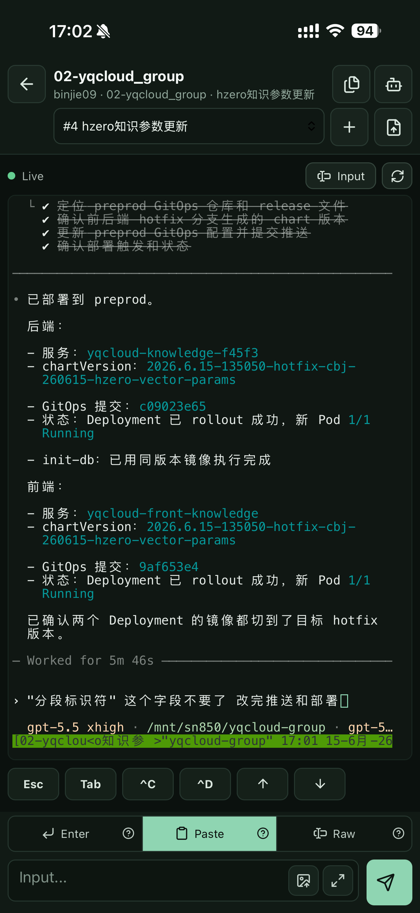
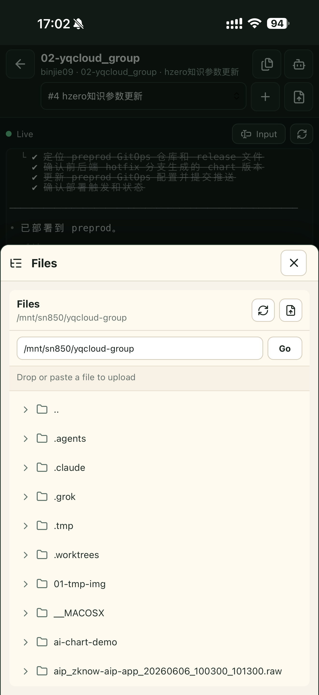
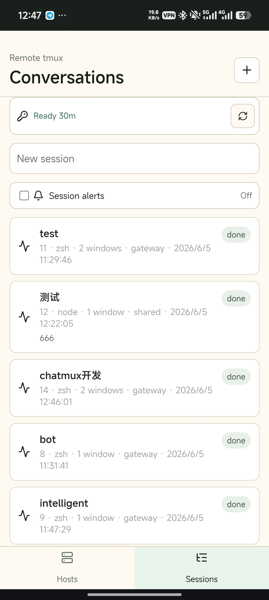
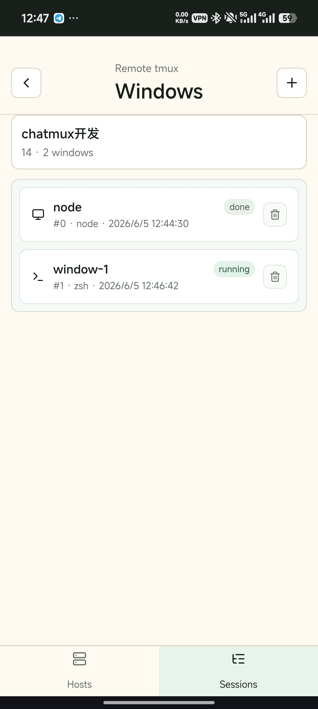
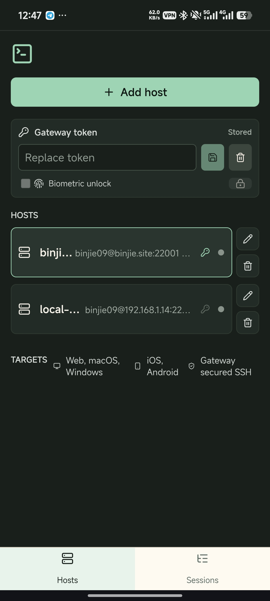
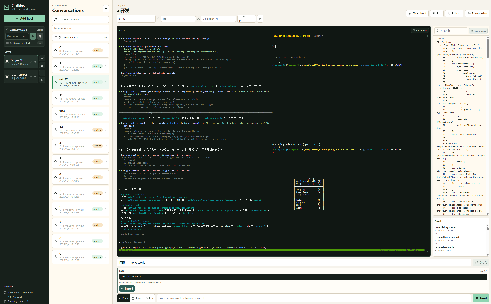

# ChatMux

> A self-hosted SSH / tmux workspace client. Connect to your own Gateway from the browser, desktop, or mobile app, restore remote tmux sessions, inspect historical context, and keep working in a real terminal.

<p align="center">
  <a href="https://github.com/binjie09/ChatMux"></a>
  
  
  
  
</p>

<p align="center">
  <a href="README.md">简体中文</a> | English
</p>

## Important Security Warning

**The web app must only connect to a ChatMux Gateway that you deploy and trust. Do not enter server addresses, SSH usernames, SSH passwords, private keys, Gateway tokens, or terminal content into any external website, third-party demo, unfamiliar domain, or unaudited hosted service.**

The ChatMux Web SPA sends the host information and SSH credentials you enter to the configured Gateway, and the Gateway opens SSH connections on your behalf. Whoever controls the Gateway is inside the trust boundary of your SSH connections. For public internet deployments, only expose your own domain, enable HTTPS, use a strong random `CHATMUX_GATEWAY_TOKEN`, and keep the data directory and `.env` file on infrastructure you control.

## Quick Self Hosting (Docker Compose)

For production web deployments, use `deploy/web/docker-compose.yml`. It builds two images:

- `chatmux-gateway`: the Go Gateway that stores SQLite data and connects to your SSH hosts.
- `chatmux-web`: an Nginx static site that reverse proxies `/api` and WebSocket traffic to the Gateway.

### 1. Clone The Repository

```bash
git clone git@github.com:binjie09/ChatMux.git
cd ChatMux
```

### 2. Create Production Environment Variables

```bash
cp deploy/web/.env.example deploy/web/.env
```

Edit `deploy/web/.env`:

```dotenv
CHATMUX_HTTP_PORT=8080
CHATMUX_GATEWAY_TOKEN=replace-with-a-long-random-token
CHATMUX_DB=/data/chatmux.db
```

`CHATMUX_GATEWAY_TOKEN` is the access token used by the web app to log in to the Gateway. It must be a strong random value. Do not commit `.env`, and do not share this token with anyone you do not trust.

### 3. Start

```bash
docker compose --env-file deploy/web/.env -f deploy/web/docker-compose.yml up -d --build
```

If your server only has the legacy standalone command, replace `docker compose` with `docker-compose`.

Visit `http://your-server:8080`. If you expose ChatMux on the public internet, put your own HTTPS reverse proxy in front, such as Caddy, Nginx, Traefik, or a cloud load balancer.

### 4. Update

```bash
git pull
docker compose --env-file deploy/web/.env -f deploy/web/docker-compose.yml up -d --build
```

See [docs/web-deployment.md](docs/web-deployment.md) for more deployment details.

## Mobile First

ChatMux is designed around phones and tablets: host management, tmux session lists, window switching, real terminal input, and historical context all work on narrow screens.

| Terminal | Files | Sessions | Windows | Hosts And Gateway |
| --- | --- | --- | --- | --- |
|  |  |  |  |  |
| Shortcuts, command input, image upload and paste, context, and terminal restore are part of the mobile workflow. | Browse remote directories, jump to paths, refresh file trees, and upload files on mobile. | View tmux session status, enable session alerts, and create sessions quickly. | Switch tmux windows and manage multiple windows in each session. | Manage Gateway tokens, SSH hosts, credential state, and mobile secure unlock. |

The desktop layout expands into a full workspace:

<p align="center">
  
</p>

## Contents

- [Quick Self Hosting (Docker Compose)](#quick-self-hosting-docker-compose)
- [Mobile First](#mobile-first)
- [Why ChatMux](#why-chatmux)
- [Features](#features)
- [Stack](#stack)
- [Local Development Quick Start](#local-development-quick-start)
- [Basic Usage Flow](#basic-usage-flow)
- [Security Model](#security-model)
- [Development And Packaging](#development-and-packaging)
- [Project Structure](#project-structure)
- [Contributing](#contributing)

## Why ChatMux

Many remote tasks do not finish after one command. Deployments, incident response, builds, AI coding sessions, and batch migrations can run for a long time. Traditional SSH clients are good at opening terminals, but weak at restoring context across devices. Chat-style tools often lose the power of a real terminal.

ChatMux uses **tmux sessions** as the durable unit of remote work:

- The real terminal remains the main interface and works with shells, vim, top, htop, lazygit, codex, and other TUI tools.
- Each remote tmux session can be named, tagged, and restored like a workspace.
- The sidebar shows session state, historical output, audit events, and AI-assisted results.
- Web, desktop, and mobile clients share the same application experience.

## Features

| Capability | Status | Notes |
| --- | --- | --- |
| Host management | Available | Add, edit, delete, and pin SSH hosts |
| SSH credentials | Available | Supports passwords and private keys; API responses never return raw credentials |
| Host fingerprint trust | Available | Confirm trust on first connection to an unknown host, then continue automatically |
| tmux sessions | Available | List, create, and open remote tmux sessions |
| Native terminal | Available | xterm.js + WebSocket PTY with interactive terminal support |
| Terminal image paste | Available | Desktop paste into native TUIs such as Codex; mobile upload can send image input through clipboard semantics |
| Historical context | Available | Capture tmux pane history and show it in the sidebar |
| Session metadata | Available | Titles, tags, and owner information |
| Audit events | Available | Records connection, credential token, and history capture events |
| Gateway token | Available | Stored locally in the web app; mobile uses secure system storage; local desktop Gateway does not require a token |
| Biometric unlock | Available | Mobile supports Face ID, Touch ID, Android biometrics, or device credentials |
| AI summaries | Optional | User-triggered when `OPENAI_API_KEY` is configured |
| AI command drafts | Optional | Generates drafts only; the user must explicitly insert and send them |
| Automation tools | Optional | Only allowlisted tools are exposed; no arbitrary shell execution tool is provided |
| Desktop app | Buildable | Tauri v2, Windows portable exe embeds the local Go Gateway |
| Mobile app | Buildable | Capacitor iOS / Android |

## Stack

- UI: React 19 + TypeScript + Vite 7
- Terminal: xterm.js
- Web: single-page app served by Nginx in production, with a Gateway reverse proxy
- Gateway: Go 1.23 for SSH, tmux, PTY, auth, audit, and AI API calls
- Desktop: Tauri v2 + Rust 2021, reusing the Web SPA
- Mobile: Capacitor 8, reusing the Web SPA
- Data: SQLite, local-first and self-hosting friendly
- Transport: HTTP JSON API + WebSocket stream
- Package manager: pnpm workspace

## Local Development Quick Start

### 1. Requirements

- Node.js 24+
- pnpm 10+
- Go 1.23+
- Docker / Docker Compose for one-command self hosting or integration tests
- Remote SSH hosts need `tmux` installed

### 2. Run Locally

```bash
pnpm install

cp .env.example .env
# Edit .env and at least replace CHATMUX_GATEWAY_TOKEN with a strong random value.

docker-compose up -d --build
```

Default endpoints:

- Web: `http://localhost:5173`
- Gateway: `http://localhost:19327`
- Health check: `http://localhost:19327/healthz`

After opening the web app, enter the `CHATMUX_GATEWAY_TOKEN` from `.env`, then add your own SSH host. The desktop app starts its embedded local Gateway and does not require a Gateway token.

## Basic Usage Flow

1. Log in to the Gateway: enter the token for your self-hosted Gateway on the ChatMux unlock page.
2. Add an SSH host: enter hostname, port, username, and choose password or private key auth.
3. Trust the host fingerprint: on first connection to an untrusted host, confirm trust in the dialog and continue automatically.
4. Save SSH credentials: click `Save SSH credential` to create a short-lived credential token.
5. Open a tmux session: select an existing session or enter a name to create a new one.
6. Use the terminal: the main area is a real terminal, and the bottom composer can send commands or paste input.
7. Inspect context: search history, summarize output, and review audit events in the side panel.

See [docs/usage.md](docs/usage.md) for detailed usage notes.

## Security Model

ChatMux's main security boundary is the **Gateway**:

- Browsers cannot SSH directly. All SSH and tmux operations are performed by the Gateway.
- Gateway APIs require `Authorization: Bearer <token>`.
- Raw SSH credentials are only accepted by `/ssh/probe` and `/ssh/credentials`.
- tmux, terminal, AI, and automation APIs only accept short-lived `credentialToken` values, not raw SSH passwords or private keys.
- Terminal input sent through the composer records audit metadata only, not the raw command text.
- Raw xterm.js keyboard input bypasses command auditing to avoid logging passwords and TUI input.
- AI summaries and command drafts are disabled by default. They are available only after `OPENAI_API_KEY` is configured, and must be triggered by the user.

Again: **do not use any ChatMux web address that you do not control, and do not enter real server addresses or passwords into external demo sites.**

## Development And Packaging

Common commands:

```bash
pnpm dev
pnpm typecheck
pnpm build

cd services/gateway
CHATMUX_GATEWAY_TOKEN=dev-token go run ./cmd/chatmux-gateway
go test ./...
```

Desktop and mobile:

```bash
pnpm --filter @chatmux/web desktop:dev
pnpm --filter @chatmux/web desktop:build
pnpm desktop:build:linux
pnpm desktop:build:macos
pnpm desktop:build:windows
pnpm --filter @chatmux/web mobile:sync
pnpm mobile:build:android-apk
pnpm --filter @chatmux/web mobile:build:android-internal
pnpm --filter @chatmux/web mobile:build:ios-testflight
```

`pnpm desktop:build:windows` uses Docker Compose to package a Windows x64 single-file portable build at `.tmp/artifacts/windows-x86_64-pc-windows-msvc/ChatMux.exe`. The exe embeds the Gateway and can be copied to Windows and started directly.

`pnpm desktop:build:linux` packages x86_64 Tauri `.deb` and `.AppImage` artifacts on Linux under `.tmp/artifacts/linux-x86_64-unknown-linux-gnu/`.

`pnpm desktop:build:macos` uses the Docker Compose orchestration in `packaging/macos/`. The local machine only needs Docker Compose and SSH. Source is synced to the macOS builder defined by `CHATMUX_MACOS_BUILDER`, artifacts are built there, and `.dmg`, `.app`, and checksum files are copied back to `.tmp/artifacts/macos-<target>/`. macOS packages cannot be produced in a pure Linux container because Tauri app bundles, signing, DMG creation, and notarization depend on Apple's toolchain.

`pnpm mobile:build:android-apk` uses Docker Compose to package an Android debug APK at `.tmp/artifacts/android/ChatMux-android-debug.apk`. The APK embeds the Gateway and starts a local `127.0.0.1:19327` Gateway inside the app, so no Gateway token is needed.

GitHub Actions includes a manually triggered `Build Artifacts` workflow, and it also runs on `v*` tag pushes. It uploads `chatmux-macos-x64`, `chatmux-macos-arm64`, `chatmux-linux-x64`, `chatmux-windows-x64`, and `chatmux-android-apk` artifacts. Without Apple Developer ID signing and notarization secrets, macOS artifacts are ad-hoc test builds and may be blocked by Gatekeeper. With `APPLE_CERTIFICATE`, `APPLE_CERTIFICATE_PASSWORD`, `APPLE_ID`, `APPLE_PASSWORD`, and `APPLE_TEAM_ID`, the workflow produces signed and notarized DMG files.

See [docs/development.md](docs/development.md) for complete development, signing, and testing notes.

## Project Structure

```text
apps/web              React / Vite SPA, reused by Tauri and Capacitor
apps/web/src-tauri    Tauri v2 desktop shell and local Gateway config
services/gateway      Go SSH / tmux Gateway
packages/shared       Shared TypeScript contracts
packaging/windows     Windows portable exe Docker packaging entry
packaging/macos       macOS artifact Docker Compose remote builder entry
packaging/android     Android APK Docker packaging entry
deploy/web            Production web self-hosting templates
docs                  Architecture, deployment, usage, and roadmap docs
```

## Contributing

Issues and pull requests are welcome. Before submitting, run:

```bash
pnpm typecheck
pnpm build
cd services/gateway && go test ./...
```

Do not paste real SSH passwords, private keys, Gateway tokens, public server IPs, or sensitive terminal output into issues, pull requests, screenshots, or logs. See [CONTRIBUTING.md](CONTRIBUTING.md) for the contribution flow and [SECURITY.md](SECURITY.md) for security reporting.

## License

This project is licensed under the [MIT License](LICENSE).

## Links

- [LINUX DO](https://linux.do)
