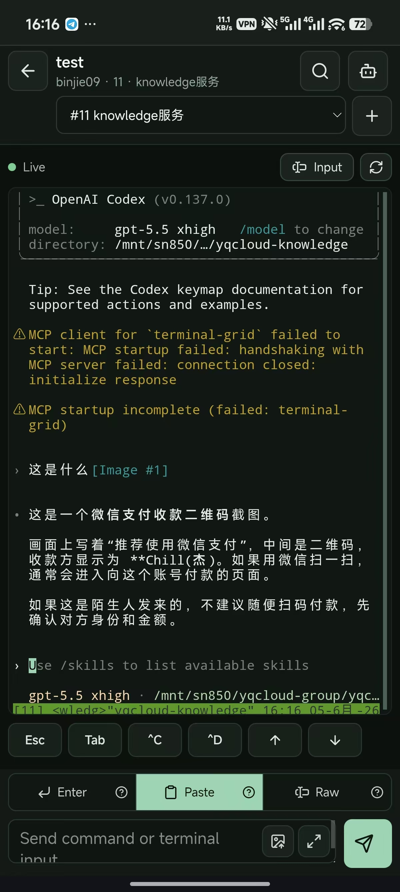

# ChatMux

> 自托管的 SSH / tmux 工作空间客户端。用浏览器、桌面端或移动端连接你自己的 Gateway，恢复远程 tmux 会话、查看历史上下文，并在真实终端里继续工作。

<p align="center">
  <a href="https://github.com/binjie09/ChatMux"></a>
  
  
  
  
</p>

## 重要安全警告

**Web 端必须只连接你自己部署、自己信任的 ChatMux Gateway。不要把服务器地址、SSH 用户名、SSH 密码、私钥、Gateway Token 或终端内容输入到任何外部网站、第三方演示站、陌生域名或未审计的托管服务。**

ChatMux 的 Web SPA 会把你填写的主机信息和 SSH 凭据提交给配置的 Gateway，由 Gateway 代你连接远程服务器。也就是说，控制 Gateway 的人就处在你的 SSH 连接信任边界内。公开互联网部署时，请只暴露你自己的域名、启用 HTTPS、使用强随机 `CHATMUX_GATEWAY_TOKEN`，并把数据目录和 `.env` 文件放在你控制的机器上。

## 移动端优先

ChatMux 的核心体验面向手机和平板：主机管理、tmux 会话列表、窗口切换、真实终端输入和历史上下文都可以在窄屏里完成。

| 真实终端主界面 | 会话列表 | 窗口管理 | 主机与 Gateway |
| --- | --- | --- | --- |
|  |  |  |  |
| 快捷键、命令输入、图片上传粘贴、上下文和终端恢复都放在手机主工作流里。 | 查看 tmux session 状态，开启 session alerts，快速创建新会话。 | 在移动端切换 tmux window，管理每个 session 里的多窗口工作。 | 管理 Gateway Token、SSH Host、凭据状态和移动端安全解锁。 |

桌面端也可以展开为完整工作台：

<p align="center">
  
</p>

## 目录

- [移动端优先](#移动端优先)
- [为什么是 ChatMux](#为什么是-chatmux)
- [功能特性](#功能特性)
- [技术栈](#技术栈)
- [快速开始](#快速开始)
- [Web 自托管部署](#web-自托管部署)
- [基础使用流程](#基础使用流程)
- [安全模型](#安全模型)
- [开发与打包](#开发与打包)
- [项目结构](#项目结构)
- [开源协作](#开源协作)

## 为什么是 ChatMux

很多远程任务不是一次命令就结束：部署、排障、编译、AI 代码生成、批量迁移都可能持续很久。普通 SSH 客户端适合进入终端，但不擅长跨设备恢复上下文；普通聊天式工具容易丢失真实终端能力。

ChatMux 把 **tmux 会话** 作为远程工作的稳定载体：

- 真实终端始终是主界面，兼容 shell、vim、top、htop、lazygit、codex 等 TUI。
- 每个远程 tmux session 可以像会话一样命名、标记和恢复。
- 侧边栏展示会话状态、历史输出、审计事件和 AI 辅助结果。
- Web、桌面端、移动端共享同一套应用体验。

## 功能特性

| 能力 | 状态 | 说明 |
| --- | --- | --- |
| Host 管理 | 可用 | 添加、编辑、删除、置顶 SSH 主机 |
| SSH 凭据 | 可用 | 支持密码和私钥；API 响应不回传原始凭据 |
| 主机指纹信任 | 可用 | 首次连接未信任 host 时弹窗确认，信任后自动继续连接 |
| tmux 会话 | 可用 | 列出、创建、打开远程 tmux session |
| 原生终端 | 可用 | xterm.js + WebSocket PTY，支持交互式终端 |
| 终端图片粘贴 | 可用 | 桌面端支持把图片粘贴进 Codex 等支持图片输入的原生 TUI；没有 X Server 或桌面图片剪切板的 Linux 服务器也能用，移动端可在输入框上传图片并通过剪切板语义送进终端 |
| 历史上下文 | 可用 | 捕获 tmux pane 历史并侧栏展示 |
| 会话元数据 | 可用 | 标题、标签、owner 信息 |
| 审计事件 | 可用 | 记录连接、凭据 token、历史捕获等关键事件 |
| Gateway Token | 可用 | Web 本地存储；移动端使用系统安全存储能力；桌面本地 Gateway 不需要 token |
| 生物识别解锁 | 可用 | 移动端可用 Face ID、Touch ID、Android 生物识别或设备凭据 |
| AI 总结 | 可选 | 配置 `OPENAI_API_KEY` 后由用户主动触发 |
| AI 命令草稿 | 可选 | 只生成草稿，必须用户显式插入和发送 |
| 自动化工具 | 可选 | 仅暴露 allowlist 工具，不提供任意 shell 执行工具 |
| 桌面端 | 可构建 | Tauri v2，Windows 便携 exe 内嵌本地 Go Gateway |
| 移动端 | 可构建 | Capacitor iOS / Android |

## 技术栈

- UI：React 19 + TypeScript + Vite 7
- 终端：xterm.js
- Web：单页应用，生产环境由 Nginx 服务静态资源并反代 Gateway
- Gateway：Go 1.23，负责 SSH、tmux、PTY、认证、审计和 AI API 调用
- 桌面端：Tauri v2 + Rust 2021，共用 Web SPA
- 移动端：Capacitor 8，共用 Web SPA
- 数据：SQLite，本地或自托管优先
- 通信：HTTP JSON API + WebSocket stream
- 包管理：pnpm workspace

## 快速开始

### 1. 准备环境

- Node.js 24+
- pnpm 10+
- Go 1.23+
- Docker / Docker Compose，用于一键自托管或集成测试
- 远程 SSH 主机需要安装 `tmux`

### 2. 本地开发运行

```bash
pnpm install

cp .env.example .env
# 编辑 .env，至少把 CHATMUX_GATEWAY_TOKEN 改成强随机值

docker-compose up -d --build
```

默认访问：

- Web：`http://localhost:5173`
- Gateway：`http://localhost:19327`
- 健康检查：`http://localhost:19327/healthz`

打开 Web 后先输入 `.env` 里的 `CHATMUX_GATEWAY_TOKEN`，再添加自己的 SSH 主机。
桌面端会启动 exe 内置的本地 Gateway，不需要输入 Gateway Token。

## Web 自托管部署

生产 Web 端建议使用 `deploy/web/docker-compose.yml`。它会构建两个镜像：

- `chatmux-gateway`：Go Gateway，保存 SQLite 数据并连接你的 SSH 主机。
- `chatmux-web`：Nginx 静态站点，反代 `/api` 和 WebSocket 到 Gateway。

### 1. 拉取代码

```bash
git clone git@github.com:binjie09/ChatMux.git
cd ChatMux
```

### 2. 创建生产环境变量

```bash
cp deploy/web/.env.example deploy/web/.env
```

编辑 `deploy/web/.env`：

```dotenv
CHATMUX_HTTP_PORT=8080
CHATMUX_GATEWAY_TOKEN=replace-with-a-long-random-token
CHATMUX_DB=/data/chatmux.db
```

`CHATMUX_GATEWAY_TOKEN` 是 Web 登录 Gateway 的访问令牌，必须使用强随机值。不要提交 `.env`，不要把这个 token 发给不可信的人。

### 3. 启动

```bash
docker compose --env-file deploy/web/.env -f deploy/web/docker-compose.yml up -d --build
```

如果你的环境只有旧版独立命令，可把 `docker compose` 替换为 `docker-compose`。

访问 `http://你的服务器:8080`。如果放到公网，请在前面接入你自己的 HTTPS 反向代理，例如 Caddy、Nginx、Traefik 或云厂商负载均衡。

### 4. 更新

```bash
git pull
docker compose --env-file deploy/web/.env -f deploy/web/docker-compose.yml up -d --build
```

更多部署说明见 [docs/web-deployment.md](docs/web-deployment.md)。

## 基础使用流程

1. 登录 Gateway：在 ChatMux 解锁页输入自托管 Gateway 的 token。
2. 添加 SSH 主机：填写主机名、端口、用户名，选择密码或私钥。
3. 信任主机指纹：首次连接未信任 host 时，在弹窗里确认信任并自动继续连接。
4. 保存 SSH 凭据：点击 `Save SSH credential` 生成短期凭据 token。
5. 打开 tmux 会话：选择已有 session，或输入名称创建新 session。
6. 使用终端：主区域是真实终端，底部 composer 可以发送命令或粘贴输入。
7. 查看上下文：右侧可以搜索历史、总结输出、查看审计事件。

详细使用方式见 [docs/usage.md](docs/usage.md)。

## 安全模型

ChatMux 的核心安全边界是 **Gateway**：

- 浏览器不能直接 SSH，所有 SSH 和 tmux 操作都由 Gateway 执行。
- Gateway API 需要 `Authorization: Bearer <token>`。
- SSH 原始凭据只被 `/ssh/probe` 和 `/ssh/credentials` 接收。
- tmux、终端、AI、自动化接口只接受短期 `credentialToken`，不接受原始 SSH 密码或私钥。
- Composer 发送的终端输入只记录审计元数据，不保存原始命令文本。
- xterm.js 原始键盘输入绕过命令审计，避免把密码和 TUI 输入写入日志。
- AI 总结和命令草稿默认关闭，只有配置 `OPENAI_API_KEY` 后才可用，并且必须由用户主动触发。

再次强调：**不要使用任何不属于你的 ChatMux Web 地址，也不要把真实服务器地址和密码输入到外部演示站。**

## 开发与打包

常用命令：

```bash
pnpm dev
pnpm typecheck
pnpm build

cd services/gateway
CHATMUX_GATEWAY_TOKEN=dev-token go run ./cmd/chatmux-gateway
go test ./...
```

桌面端和移动端：

```bash
pnpm --filter @chatmux/web desktop:dev
pnpm --filter @chatmux/web desktop:build
pnpm desktop:build:windows
pnpm --filter @chatmux/web mobile:sync
pnpm --filter @chatmux/web mobile:build:android-internal
pnpm --filter @chatmux/web mobile:build:ios-testflight
```

`pnpm desktop:build:windows` 使用 Docker Compose 打包 Windows x64 单文件便携版，
产物是 `.tmp/artifacts/windows-x86_64-pc-windows-msvc/ChatMux.exe`。这个 exe
内嵌 Gateway，复制到 Windows 后双击即可启动本地桌面端。

更完整的开发、签名和测试说明见 [docs/development.md](docs/development.md)。

## 项目结构

```text
apps/web              React / Vite SPA，Tauri 和 Capacitor 也复用它
apps/web/src-tauri    Tauri v2 桌面壳和本地 Gateway 配置
services/gateway      Go SSH / tmux Gateway
packages/shared       共享 TypeScript contracts
packaging/windows     Windows 便携 exe Docker 打包入口
deploy/web            生产 Web 自托管部署模板
docs                  架构、部署、使用和路线图文档
```

## 开源协作

欢迎提交 issue 和 pull request。提交前请先运行：

```bash
pnpm typecheck
pnpm build
cd services/gateway && go test ./...
```

请不要在 issue、PR、截图或日志里粘贴真实 SSH 密码、私钥、Gateway Token、服务器公网 IP 或敏感终端输出。贡献流程见 [CONTRIBUTING.md](CONTRIBUTING.md)，安全报告见 [SECURITY.md](SECURITY.md)。

## License

本项目采用 [MIT License](LICENSE)。
